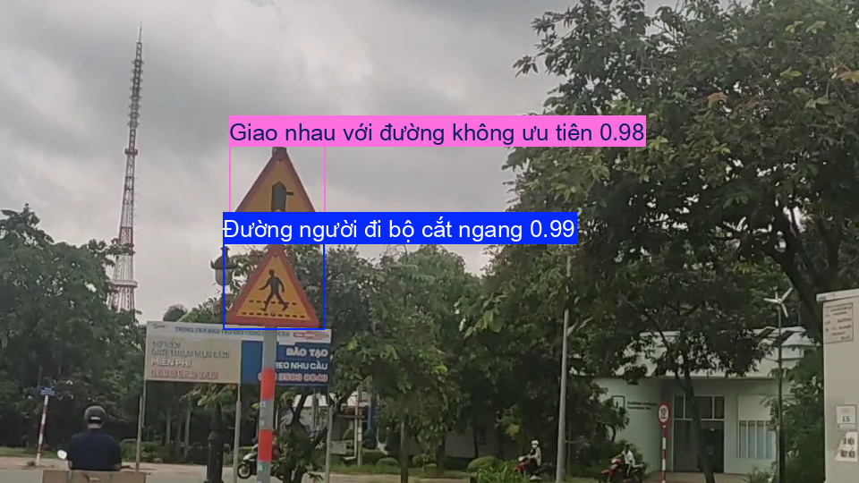

# 🚦 Real-Time Traffic Sign Detection (Webcam)

  

A real-time Vietnamese traffic sign detection system using **YOLOv11** and **FastAPI**.

---

## 🧾 Dataset: Vietnamese Traffic Signs (VNTS)

This project uses the **Vietnamese Traffic Signs Dataset** from Kaggle:  
👉 https://www.kaggle.com/datasets/maitam/vietnamese-traffic-signs

### 📌 Dataset Information

- **Images:** ~3,216 JPG images
- **Labels:** Each image has XYWH annotated bounding boxes for traffic signs
- **Classes:** 51 unique traffic sign categories  
- Examples include speed limits, warning signs, prohibitions, etc.
- **Conditions:** Varied lighting, blur, noise conditions to ensure real-world variety
- **Usage License:** Creative Commons Attribution-ShareAlike 4.0 (CC-BY-SA)
- **Intended Use:** Research and development of traffic sign recognition systems

Dataset can be explored and downloaded at the Kaggle link above.

---

## 🎥 Features

- 🔴 Real-time webcam traffic sign detection  
- 📍 Bounding boxes + class labels + confidence scores  
- 🌐 Web interface built with FastAPI + Javascript  
- 🧠 YOLOv11 deep learning model  
- 🚀 Easy to install and deploy locally

---

## 🧠 Model Overview

- **Model Architecture:** YOLOv11 (Ultralytics implementation)
- **Trained on:** VNTS dataset (51 classes)
- **Framework:** PyTorch  
- **Output:** Live detection from webcam frames

---

## 📁 Project Structure

traffic-sign-detection/
│
├── best.pt
├── app.py
├── requirements.txt
├── README.md
└── templates/
    └── index.html

---

## ▶️ Run Application

uvicorn app:app --reload  

Open in browser:

http://127.0.0.1:8000  

Allow camera access when prompted.

---

## 🔍 How It Works

1. Browser captures webcam frames
2. Frames are sent to FastAPI backend
3. YOLO model performs inference
4. Detection boxes are returned
5. JavaScript draws bounding boxes on canvas overlay

---
